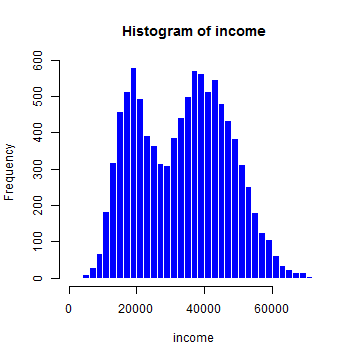

---

##
title       : Developing Data Products Course Project
subtitle    : Predicting Credit Defaulters
author      : Goh Yong Liang
job         : 
framework   : io2012   # {io2012, html5slides, shower, dzslides, ...}
highlighter : highlight.js  # {highlight.js, prettify, highlight}
hitheme     : tomorrow      # 
widgets     : []            # {mathjax, quiz, bootstrap}
mode        : selfcontained # {standalone, draft}
knit        : slidify::knit2slides

---

## Introduction

This Shiny application was developed for the "Developing Data Products" Coursera course as part of the Johns Hopkins University Data Science Specialization.

This app enables a user to easily explore and develop simple logistic regression models for the "Default" data set found in the ISLR package. This is a simulated data set which aims to predict which customers will default on their credit card debt; it contains the variables, `income`, `student` and `balance`. These variables can be used to predict the outcome given in `default`.

The app contains 3 main functions: Data, Histogram and Model.

Click on the following link to access the app: https://legoh.shinyapps.io/myapp/

--- .class #id 

## Data 

The data set used in this application is given as follows:

```r
library(ISLR);data(Default);head(Default)
```

```
##   default student   balance    income
## 1      No      No  729.5265 44361.625
## 2      No     Yes  817.1804 12106.135
## 3      No      No 1073.5492 31767.139
## 4      No      No  529.2506 35704.494
## 5      No      No  785.6559 38463.496
## 6      No     Yes  919.5885  7491.559
```

---

## Histogram

The histogram allows for the user to select which variable, `income` or `balance` to plot a histogram on. It is controlled mainly by the following function:

```r
hist(Default$income, breaks = 30, col = 'blue', border = 'white', 
     main = "Histogram of income",xlab = "income")
```



---

## Model

The modeling technique used for this app is a simple logistic regression model. It is run by the "glm" method in the caret package. The user is allowed to choose the training data set size as well as the variables used. The output of the model will be the confusion matrix and model metrics.

```
##          Sensitivity          Specificity       Pos Pred Value 
##            0.9961200            0.3308271            0.9774112 
##       Neg Pred Value           Prevalence       Detection Rate 
##            0.7457627            0.9667417            0.9629907 
## Detection Prevalence    Balanced Accuracy 
##            0.9852463            0.6634735
```

```
##           Reference
## Prediction   No  Yes
##        No  3851   89
##        Yes   15   44
```


